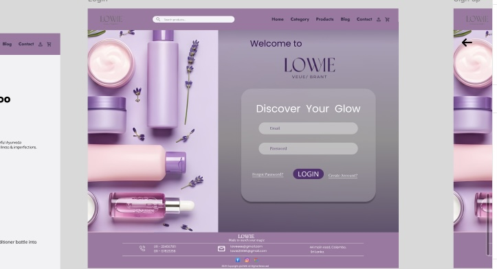

# Beauty Product E-Commerce Website

## HCI Team Project

A team-based Human-Computer Interaction (HCI) project focused on designing a user-friendly beauty product e-commerce website.

The project was designed using Figma, with the goal of creating a clean, intuitive, and visually appealing shopping experience for users.

## My Contribution

### Login Page Design

My main contribution to this team project was designing the **Login Page** of the website.

I focused on creating a simple and user-friendly login experience while maintaining consistency with the overall visual design of the beauty product website.

### Responsibilities

- Designed the Login Page UI in Figma
- Planned the layout and placement of login elements
- Focused on usability and user-friendly interaction
- Maintained consistency with the overall website design
- Contributed to the HCI design process as part of the team

## Tools Used

- Figma
- Human-Computer Interaction (HCI) Design Principles

## Project Preview

### Login Page

## Project Type

**Team Project – Human-Computer Interaction (HCI)**

## My Role

**UI/UX Designer – Login Page**

## Design Tool

**Figma**

## Figma Design

[View the Figma Design](https://www.figma.com/design/OAbmDb0w7LNlZW6xWPku00/Cosmatics-App?node-id=0-1&t=3oPtooh6IIIfGHNF-1)
